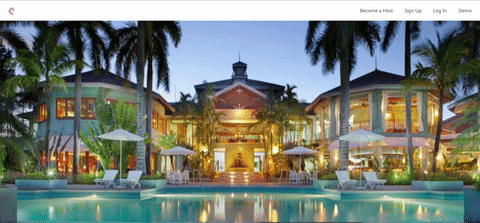
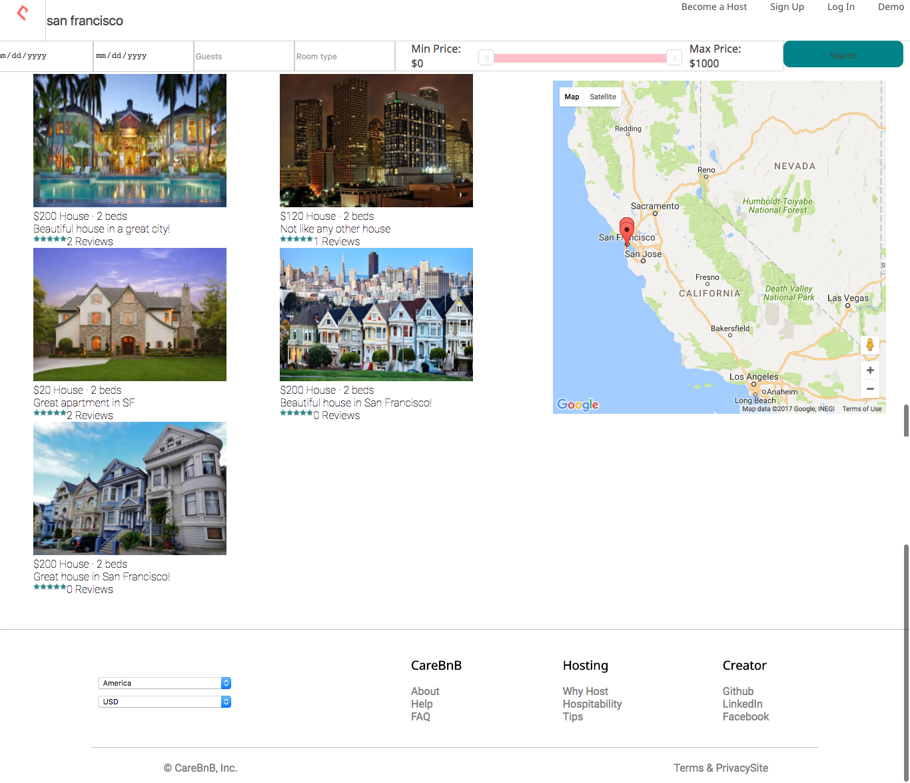
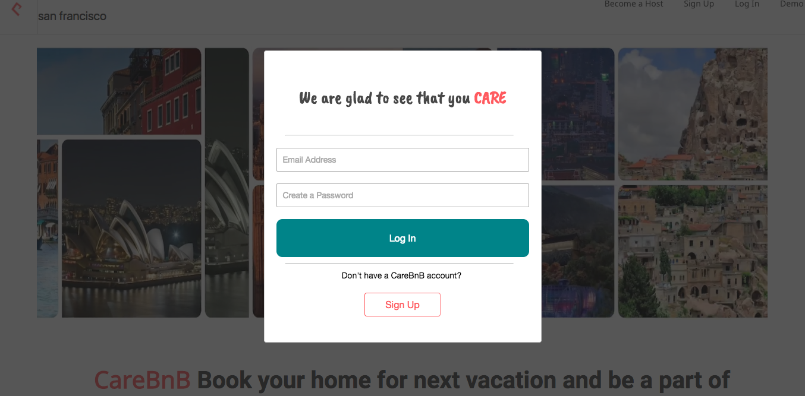
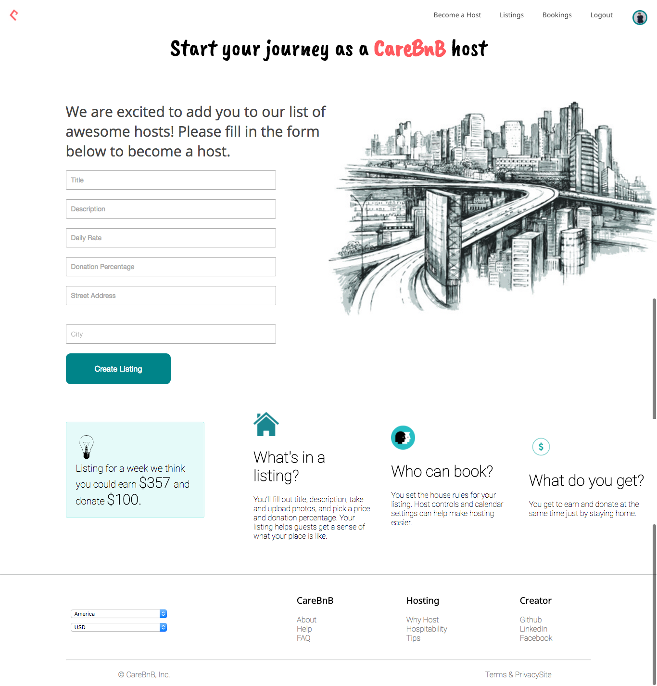

# CareBNB

CareBNB is an Airbnb inspired web application created by Md Farshid Zaman. It has the same features as Airbnb where a user can book homes/rooms for a given number of days in any city. One distinctive feature that CareBNB have is that a certain percentage of the rent(chosen by the host) will go towards charity. Take a look at it live at [http://www.carebnb.site](http://www.carebnb.site). Once signed up, users can log in and create listings or book homes for their next vacation.

[Live Here][live]

[live]: http://www.carebnb.site


## Features

* Authentication
  * Session is authenticated in the backend. All queries return data that corresponds to the proper user.
  * User can sign up and log in from any page in the app.
* Create Listings
  * User can create listings to rent out their rooms/apartments.
* Book Listings
  * User can book rooms/apartments in different cities.
* Reviews on Listings
  * User can post reviews for different listings.
* Search Listings
  * User can search for rooms/apartments according to their needs.
* Google map Integration
  * Search process includes google map interaction which can create and remove markers based on search parameter.

```javascript
  updateMarkers(listings) {
    let myListings = Object.keys(listings);
    myListings.pop();
    this.listings = myListings.map(id => listings[id]);
    this._listingsToAdd().forEach(this._createMarkerFromListing.bind(this));
    this._markersToRemove(myListings).forEach(this._removeMarker.bind(this));
  }

  _markersToRemove(listings) {
    const currentListings = listings.map((listing) => parseInt(listing));
    return this.markers.filter(marker => !currentListings.includes(marker.listingId));
  }

  _removeMarker(marker) {
    const idx = this.markers.indexOf(marker);
    marker.setMap(null);
    this.markers.splice(idx, 1);
  }
```
## Code Guide

If you would like to take a closer look at the code behind the CareBnB App, the best folders to look in are:

* [care_bnb.jsx](./frontend/care_bnb.jsx)
* [React components](./frontend/components)
  * [App](./frontend/components/app.jsx)
* [Rails controllers](./app/controllers/api)
* [Store](./frontend/store/store.js)
* [Api Util](./frontend/util/)
* [DB Schema](./db/schema.rb)
* [Rails Routes](./config/routes.rb)

## Languages, Frameworks, Libraries, Etc.

* Ruby on Rails
* JavaScript
* PostgreSQL
* React
* Redux
* jquery
* Google Maps API
* Gems
  * Paperclip
  * Geocoder
  * Jbuilder
  * BCrypt

## Screenshots

Listings Page




Search Page



Login Page



Host Sign Up Page

